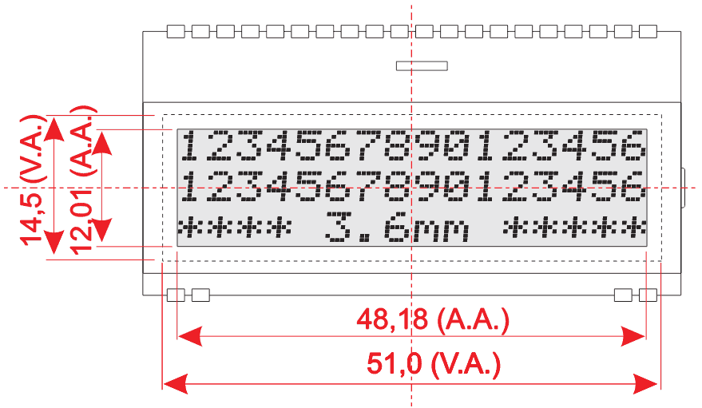
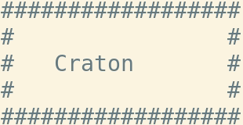

Emulator Output
===============

This project requires the implementation of a very simple processor to execute instructions. The instruction format used is intended to be very simple (while not being space efficient).

The project extends a previous project to add a basic output device using memory-mapped I/O.

Device Overview
---------------

The display device is a 16x3 character display that may look something like the following:



The device is mapped to memory locations 64-127, so the overall memory map of our device is now:

| Range       | Type            |
| ----------- | --------------- |
| 0x00 - 0x3f | Main memory     |
| 0x40 - 0x4f | Display control |
| 0x50 - 0x5f | Display line 1  |
| 0x60 - 0x6f | Display line 2  |
| 0x70 - 0x7f | Display line 3  |
| 0x80 - 0xff | Main memory     |

We can interface with our device using the following memory locations:

- 0x40 - Display mode register (set to 1 to swap memory buffer to display)
- 0x41 - 0x71 - Words representing the characters on the screen as an int[3][16] array. The low byte of each integer represents the character value in [ASCII](https://en.wikipedia.org/wiki/ASCII#Printable_characters).

Marquee
-------

Your task is to create a program `marquee.asm` that creates a marquee text of your name:



This should scroll a few times and then halt the CPU.

Instruction Format
------------------

Instructions are all 4 bytes. Each byte represents the following:

- Byte 0: Operation to execute
- Byte 1: Source register
- Byte 2: Destination register
- Byte 3: Immediate Value (signed)

Specifically, instructions are defined as:

```c
typedef struct {
  Operation op;
  Register src;
  Register dst;
  signed char immediate;
} Instruction;
```

Operations
----------

This simple processor supports the following operations:

1. Halt - Stop the processor
2. LoadImmedate - Store the value in `immediate` to register `dst`.
3. Add - Add the value from register `src` to the value in register `dst` and store the result in `dst`.
4. AddImmediate - Add the value in `immediate` to register `src` and store the result in register `dst`.
5. Move - Copy the contents of register `src` to register `dst`.
6. And - Bitwise `and` the value from register `src` to the value in register `dst` and store the result in `dst`.
7. Or - Bitwise `or` the value from register `src` to the value in register `dst` and store the result in `dst`.
8. Xor - Bitwise `xor` the value from register `src` to the value in register `dst` and store the result in `dst`.
9. Jump - Jump to the absolute position stored in the `immediate` value.
10. BranchOnEqual - Jump to the absolute position stored in the `immediate` value if and only if the values in the `src` and `dst` registers are equal.
11. LoadDirect - Load the value stored in the memory location pointed to by `immediate` into the `dst` register.
12. StoreDirect - Store the value stored in register `src` into the memory location pointed to by the `immediate` value.
13. LoadIndirect - Load the value stored in the memory location pointed to by the value in `src` into the `dst` register.
14. StoreIndirect - Store the value stored in register `src` into the memory location pointed to by the value stored in `dst`.
15. SleepImmediate - Sleep for `immediate` hundredths of seconds.

Running
-------

The emulator can be compiled and tested by invoking:

```
make
```
